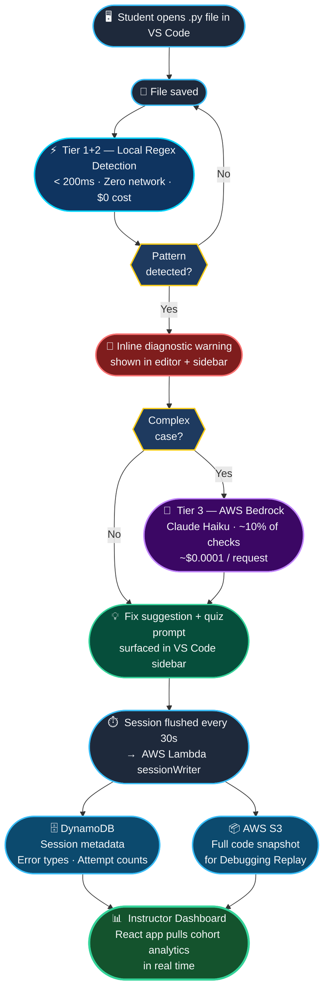

# Slide 4 — How It Works

**Subtitle:** A three-tier architecture keeps latency near zero, preserves privacy for routine checks, and escalates only complex patterns to cloud AI.

---

## Flow Diagram

---

## Slide Content

### End-to-End Data Flow

| Step | What Happens | Where |
|------|-------------|-------|
| **1. Open** | Student opens a `.py` file → Synapse activates | VS Code |
| **2. Save** | File saved → Tier 1+2 local regex runs instantly | Local (in-process) |
| **3. Detect** | Pattern matched → inline warning + sidebar update | VS Code editor |
| **4. Escalate** | Complex pattern → Tier 3 AWS Bedrock Claude Haiku | Cloud (10% of checks) |
| **5. Surface** | Fix suggestion + quiz prompt shown to student | VS Code sidebar |
| **6. Flush** | Sessions sent every 30s → Lambda `sessionWriter` | AWS Lambda |
| **7. Store** | Metadata → DynamoDB · Code snapshot → S3 | AWS |
| **8. Analyse** | Dashboard pulls cohort analytics in real time | React dashboard |

---

## Key Architecture Callouts

- **Tier 1+2 runs entirely on the student's machine** — no data leaves VS Code for routine checks
- **Only ~10% of checks ever reach Bedrock** — cost is near zero, privacy is preserved by default
- **30-second flush interval** — balances real-time feel with network efficiency
- **DynamoDB + S3 are decoupled** — session metadata and code snapshots stored separately for flexibility
- **Dashboard is read-only from AWS** — pull-based, not push, keeping the architecture simple

---

## Flow Highlights (Footer copy for slide)

> Local checks are instant and cost-free · ~10% of cases escalate to Bedrock for deeper AI reasoning · Sessions flush every 30s to Lambda, which writes metadata to DynamoDB and snapshots to S3 for replay

---

*Speaker note: Walk the flow left to right, top to bottom. Pause at the Tier 1+2 box — that's the performance story. Pause at Bedrock — that's the AI story. The two together are why Synapse is fast AND smart. If demoing live, trigger a None Handling error and show the diagnostic appearing before you finish typing.*
